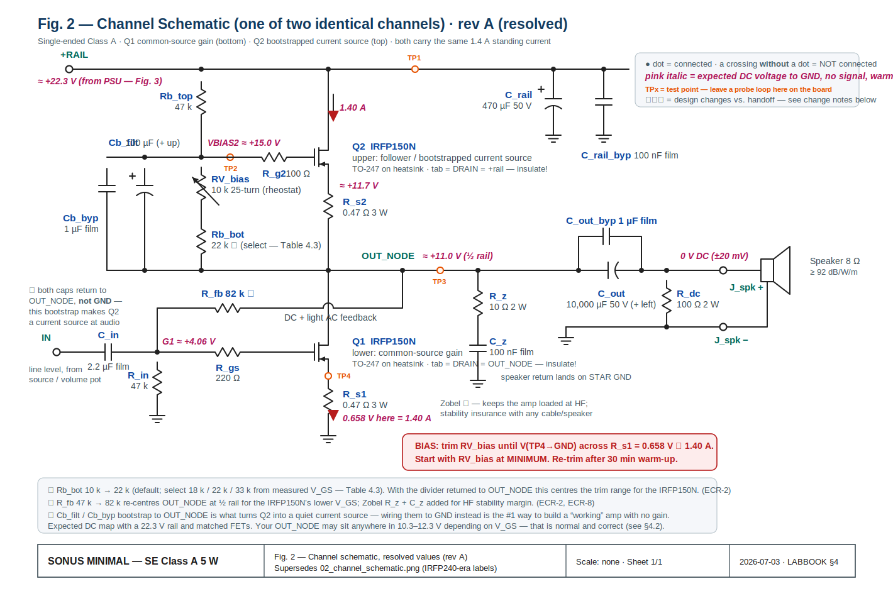
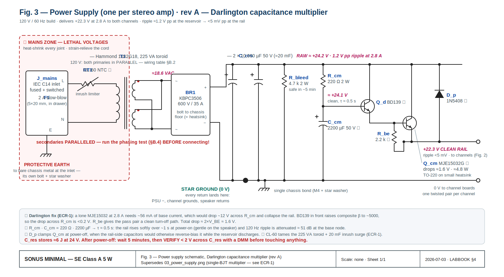
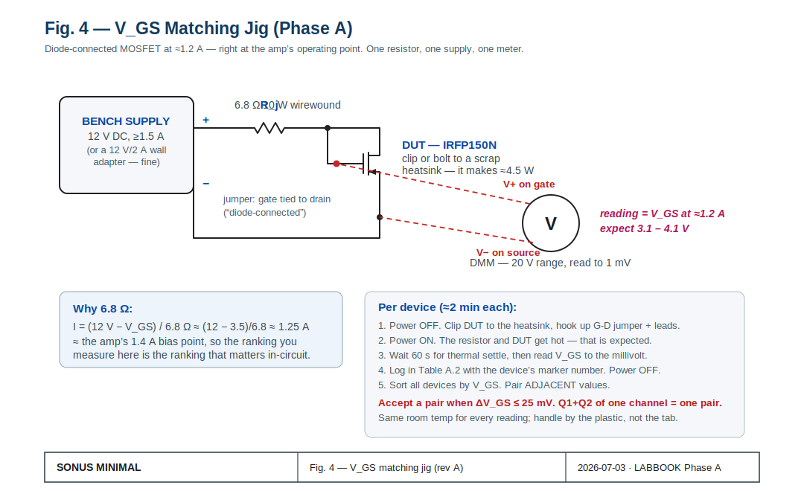
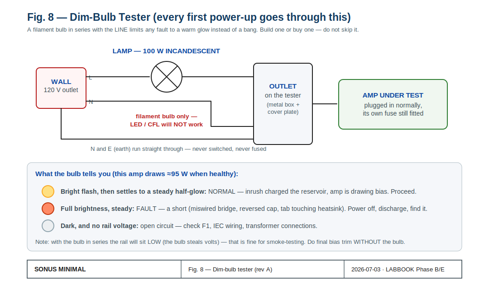
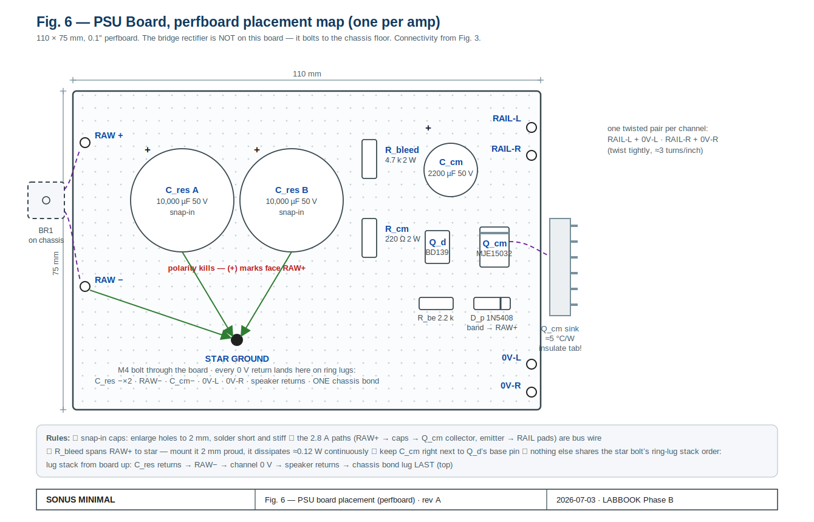
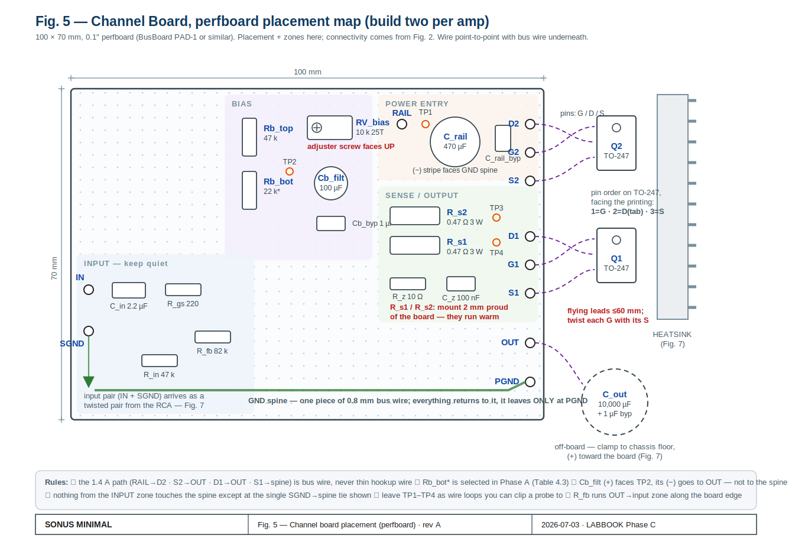
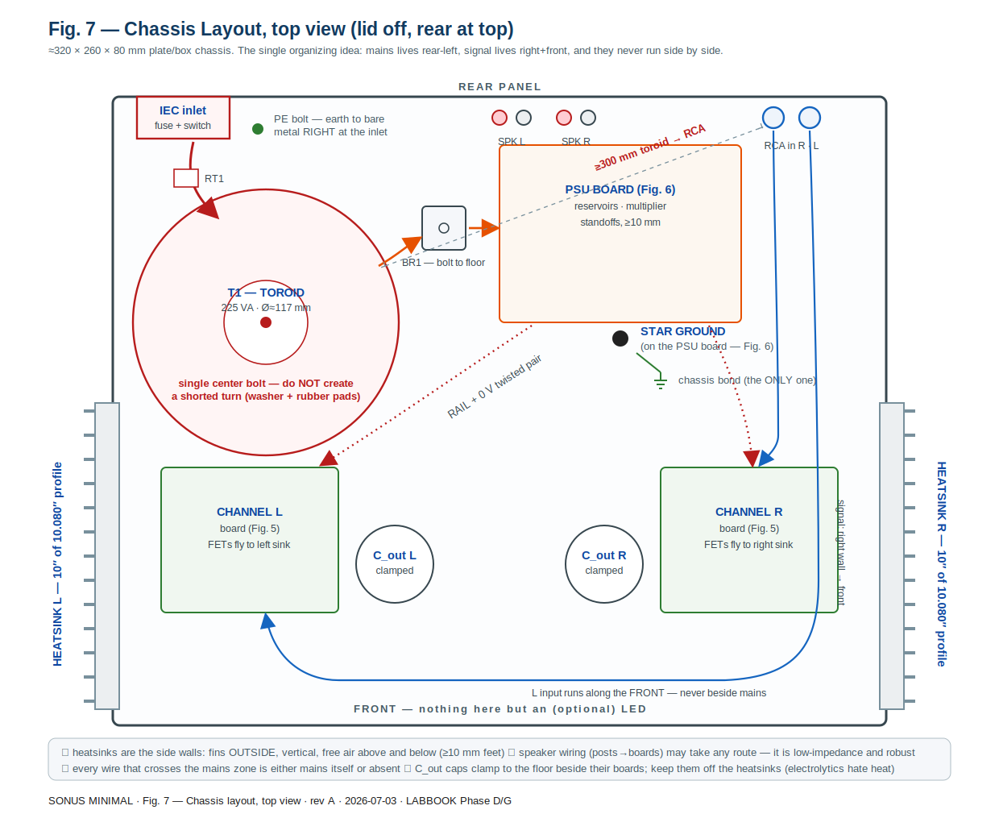
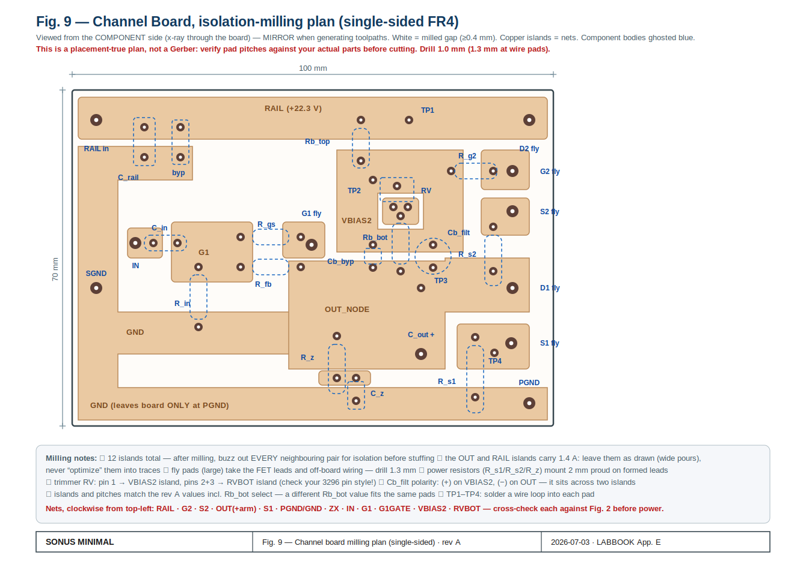
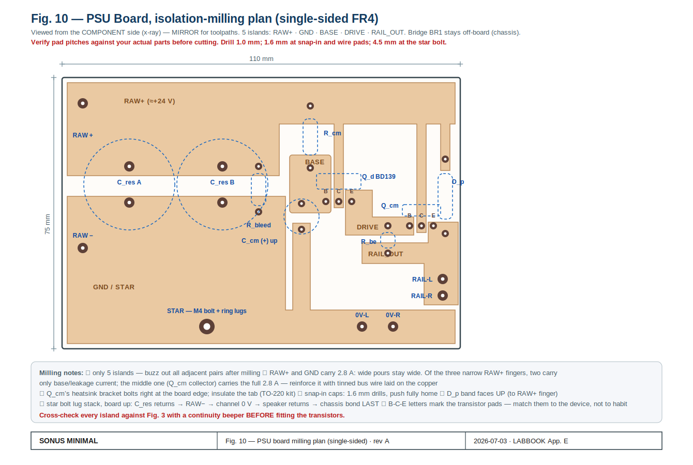

# SONUS MINIMAL — Build Lab Book

**Single-ended Class A MOSFET amplifier · ~5.5 W/channel into 8 Ω · Pass ACA lineage**
**Document:** LABBOOK rev A · 2026-07-03 · supersedes nothing (first edition)
**Design baseline:** `docs/original/Sonus-Minimal-handoff.md` (BOM rev3) → resolved here as **rev 4**
**Mains:** 120 V / 60 Hz (US). 230 V differences are flagged where they occur.

| Unit serial | Builder | Started | Completed | Sign-off (Phase G) |
|---|---|---|---|---|
| SM-001 | | | | |
| SM-002 | | | | |
| SM-003 | | | | |

---

## Contents

- [§0 How to use this book](#sec-0)
- [§1 What you are building](#sec-1)
- [§2 Theory in thirty minutes + reading list](#sec-2)
- [§3 Engineering change record — how rev 3 became rev 4](#sec-3)
- [§4 The final design — single source of truth](#sec-4)
- [§5 Safety, tools, workspace](#sec-5)
- [Phase A — Inventory & MOSFET matching](#phase-a)
- [Phase B — Power supply build & solo test](#phase-b)
- [Phase C — Channel boards](#phase-c)
- [Phase D — Heatsinks & mechanical](#phase-d)
- [Phase E — First power-up & bias](#phase-e)
- [Phase F — Verification & performance](#phase-f)
- [Phase G — Final assembly, listening, sign-off](#phase-g)
- [Troubleshooting](#ts)
- [Appendices A–F](#appendix-a)

---

## §0 How to use this book

Work **strictly in phase order**. Each phase ends with a gate — a short checklist that must be
fully true before you continue. Skipping a gate is how amplifiers explode.

Conventions:

- `☐` is a step you check off. **Record boxes** look like `V = ______` — write measured values
  in ink, in this book (or the per-unit logs in Appendix A). A lab book with empty boxes is a
  story; a lab book with numbers is evidence.
- ⚠ **DANGER** — mains or stored-energy hazard. Read twice, then act once.
- ⏱ — a mandated wait (thermal settle, capacitor discharge). Do not shortcut them.
- 📖 — a pointer into the reading list (§2) if you want the *why* behind the step.
- **Figures** live in `diagrams/` as SVG (`fig01`–`fig10`). Print Fig. 2, Fig. 3, and Fig. 5 and
  keep them at the bench.
- Every expected value in this book assumes the **rev 4** design (§4) and a 22.3 V rail. The
  original documents say "24 V" — §3/ECR-4 explains why the honest number is lower and why
  that is fine.

Time budget (per amplifier, experienced beginner): A: 3 h (once, covers all three amps) ·
B: 4 h · C: 5 h · D: 3 h · E: 2 h · F: 3 h · G: 2 h → **≈ 20 h for the first unit**, roughly
half that for each following one.

---

## §1 What you are building

A stereo, single-ended, **Class A** MOSFET amplifier in the Nelson Pass *Amp Camp Amp* /
First Watt tradition. Two transistors per channel carry a constant 1.4 A; the speaker gets the
*variation* in that current. There is no crossover distortion because there is no crossover —
one device chain does all the work, all the time. The price is heat: the amp burns ~95 W from
the wall whether it is whispering or working.

Design intent (from the original write-up, unchanged): *one dominant, smoothly decaying
2nd-harmonic coloration and the absence of everything that sounds hard — crossover artifacts,
high-order products, hum, subsonic rumble.*

**Honest specification (rev 4):**

| Parameter | Value | Notes |
|---|---|---|
| Output power, 8 Ω | ≈ 5.5 W at clipping onset | current-limited to ≈3.9 W into 4 Ω |
| Class A envelope | up to ≈ 7 W (8 Ω) | soft 2nd-harmonic clipping beyond |
| Rail | **+22.3 V ± 1 V** | "24 V" in older docs — see ECR-4 |
| Standing bias | 1.40 A per channel | 0.658 V across R_s1 |
| Voltage gain | ≈ 19–21 dB (measure yours) | full power from ≈ 0.65 V rms |
| Output impedance | ≈ 0.6–0.8 Ω (DF ≈ 10–13) | source-follower + light feedback |
| Bandwidth | ≈ 2 Hz – >100 kHz (−3 dB) | LF corner set by C_out into 8 Ω |
| Hum & noise | < 100 µV at output (target) | cap-multiplier rail, star ground |
| THD @ 1 W, 1 kHz | ≈ 0.1–0.5 %, H2-dominant | this is the *design goal*, not a defect |
| Power from wall | ≈ 95 W continuous | heat, always — see the two non-negotiables |
| Speakers required | **≥ 92 dB/W/m, ideally 95+** | non-negotiable #1 |
| Heatsinking | **≤ 0.5–0.6 °C/W per channel** | non-negotiable #2 |

The two non-negotiables are inherited verbatim from the original design: this amplifier on an
85 dB bookshelf speaker is a disappointment by construction, and on an undersized heatsink it
is a fire hazard by construction. Neither can be fixed downstream.

---

## §2 Theory in thirty minutes + reading list

You can build this amp by following the steps alone. Read this section anyway — every
debugging decision in Phases E–F gets easier when you know what each part is *for*.

### 2.1 The output stage: two identical MOSFETs, two different jobs

The rail-to-ground stack is: `+22.3 V → Q2 → R_s2 → OUT_NODE → Q1 → R_s1 → GND`.

- **Q1 (bottom) is the voltage amplifier.** Common-source: the input signal wiggles its gate,
  and it responds by conducting more or less of the standing current. Its gain is
  approximately `gm·R_load / (1 + gm·R_s1)` ≈ 10–13× with an 8 Ω load. 📖 AoE §3.2.
- **Q2 (top) is a current source disguised as a follower.** Its gate is biased by the
  Rb_top / RV_bias / Rb_bot divider, and — this is the essential trick — that bias node is
  **bootstrapped to OUT_NODE through Cb_filt ∥ Cb_byp**, not bypassed to ground. At audio
  frequencies Q2's gate-to-source voltage therefore never changes, which makes Q2 a constant
  1.4 A current source hovering over Q1. All of Q1's signal current has nowhere to go but the
  speaker. Wire those two capacitors to ground instead and you get a "working" amp with a gain
  of 0.3 — the single most common way to mis-build this circuit. 📖 Pass, *Amp Camp Amp*;
  AoE §2.2.5 (current sources), §2.4 (bootstrapping).
- **R_s1, R_s2 (0.47 Ω)** are simultaneously degeneration (they linearize and thermally
  stabilize the FETs) and your **bias ammeters**: V = I·R, so 1.40 A reads as 0.658 V. You will
  set bias by trimming for that voltage.
- **DC feedback** (R_fb 82 k from OUT_NODE to Q1's gate, against R_in 47 k to ground) holds
  OUT_NODE near half-rail: if the output drifts up, Q1's gate is pulled up, Q1 conducts harder,
  and the output comes back down. The same network applies *light* AC feedback — enough to set
  damping, deliberately not enough to scrub the 2nd harmonic. 📖 Pass, *Zen Amp* (the same
  self-biasing idea with one FET).
- **C_out (10 mF)** couples the speaker because a single-rail amp's output idles at +11 V.
  Corner ≈ 2 Hz into 8 Ω. R_dc bleeds the speaker side to 0 V. The Zobel (R_z + C_z) keeps
  the amp loaded at HF where speaker cables turn weird. 📖 Self, *Audio Power Amplifier
  Design*, output networks chapter.

### 2.2 The power supply: quiet beats stiff

A single-ended stage has almost no power-supply rejection: whatever ripple is on the rail
walks straight into the speaker. So the design spends its effort on *quiet*:
toroid → bridge → 20 mF reservoir (ripple ≈ 1.2 V pp) → **capacitance multiplier**.

The multiplier is an emitter follower whose base sits on an RC-filtered copy of the raw rail
(R_cm·C_cm, τ ≈ 0.5 s → ripple down ~51 dB). The emitter — your clean rail — follows the
smooth base, minus ~1.6 V. It is not a regulator: the rail sags gently with mains voltage,
which Class A does not care about, and it costs two transistors, not a control loop.
rev 4 made it a **Darlington** (BD139 driving MJE15032) because the single-BJT version could
not supply 2.8 A of load through a 220 Ω base feed — the arithmetic is in ECR-1. A CL-60
inrush thermistor and a reverse-clamp diode complete it. 📖 Elliott (ESP) Project 15;
AoE §9.x (linear supplies).

### 2.3 Why Class A single-ended runs this hot

Bias must exceed the largest current you will ever ask the speaker for: 1.4 A standing gives
±1.4 A of swing, i.e. ~7 W into 8 Ω before the top device starves. Both FETs dissipate
`(V_ds × 1.4 A)` continuously — ≈ 14 W each — and the PSU pass transistor another ~5 W.
Heat is the design's dominant mechanical constraint; that is why Phase D is a whole phase.
📖 Self, Class-A chapter; Elliott, heatsink design article.

### 2.4 Reading list

| Ref | What to read | Why |
|---|---|---|
| Nelson Pass, **"The Amp Camp Amp"** (AudioXpress 2012; firstwatt.com → articles; diyAudio ACA build guide) | whole article | This is the direct ancestor: same stack, same bootstrap trick |
| Nelson Pass, **"Zen Amp"** + **"Zen Variations"** (passdiy.com) | Zen; ZV1–2 | Self-biasing feedback, SE Class A philosophy, matching |
| Horowitz & Hill, **The Art of Electronics** 3rd ed. | §3.1–3.2 (FETs), §2.2.5 & 2.4 (current sources, bootstrap), Ch. 9 (supplies & thermal) | The *why* under every step in this book |
| Douglas Self, **Audio Power Amplifier Design** 6th ed. | Class-A chapter; grounding chapter | Rigor on THD mechanisms, star grounding |
| Rod Elliott (sound-au.com), **Project 15** (capacitance multiplier), **"Heatsink design"**, **"Death of Zen (DoZ)"** | all three | Practical multiplier + thermal design + another SE Class A build narrative |
| Datasheets: **IRFP150N** (Infineon/IR), **MJE15032** (onsemi), **BD139**, **CL-60** (Amphenol) | transfer & SOA curves | Source of every Vgs/β number used in §3 |
| REW (roomeqwizard.com) or ARTA manual | soundcard THD measurement setup | Phase F instrumentation |

---

## §3 Engineering Change Record

The rev 3 handoff listed eight open items. Each is resolved below **with the arithmetic
shown** — check it, don't trust it. The result is BOM **rev 4** (`docs/BOM-rev4.csv`).
Two of these (ECR-1, ECR-2) were build-blocking: the amp as drawn in rev 3 would not have met
its spec.

### ECR-1 — Cap multiplier would have collapsed *(open item 1 — blocking)*

**Problem.** MJE15032 at I_C = 2.8 A has β ≈ 50–100 (datasheet hFE curves). Base current
I_B = 2.8 / 50 ≈ **56 mA** worst-case; drop across R_cm = 220 Ω → **12.3 V**. The "+24 V"
rail becomes ~11 V. Even at β = 100 you lose 6 V.

**Fix.** Darlington: BD139 (β ≈ 100 at 30 mA) drives the MJE15032. Composite β ≈ 5000 →
I through R_cm ≈ 0.5 mA → drop ≈ 0.1 V. Costs one extra V_BE (total drop ≈ 1.6 V), one
TO-126 transistor, and R_be 2.2 k for clean turn-off. Added while in there: **D_p** (1N5408)
clamps the pass pair when the rail-side capacitance holds voltage after power-off, and
**RT1** (CL-60) tames the inrush of a 225 VA toroid charging 20 mF. *BOM: +BD139, +R_be,
+1N5408, +CL-60.*

### ECR-2 — IRFP150N shifts the operating point *(open items 2, plus stability — blocking)*

**Problem.** The circuit self-biases: with matched FETs the equilibrium is
`Vg1 = Vout·R_in/(R_in+R_fb)` and `Vg1 = V_GS(1.4 A) + 0.66 V`. The design was narrated
around the IRFP240 (V_GS ≈ 4.5 V at 1.4 A) but the rev 3 BOM ships the **IRFP150N**
(V_GS ≈ 3.4 V warm). With the old 47 k : 47 k network, OUT_NODE self-sets at
2 × (3.4 + 0.66) ≈ **8.1 V** — not ~11 V. Down-swing dies at ≈ −6.5 V pk → **≈ 2.7 W**
before clipping. Spec busted.

**Fix (verified numerically — see `spice/` and the solver run recorded below).**
- **R_fb 47 k → 82 k**: divider ratio becomes 47/129 = 0.364, so OUT_NODE ≈ (V_GS+0.66)/0.364
  ≈ 11 V for a typical part. Input impedance stays 47 k; feedback gets slightly lighter
  (in the spirit of the original §4).
- **Rb_bot 10 k → 22 k default, selected per Table 4.3** (18 k / 22 k / 33 k against the
  V_GS you measure in Phase A), divider returned to OUT_NODE. Numeric check with a
  square-law IRFP150N model (Kp=25, Vto=3.0): trimmer lands 1.40 A at Rrv ≈ 3.4 k —
  mid-range — with OUT_NODE = 10.9 V; the select table trims 1.40 A across Vto 2.6–3.4 with
  OUT_NODE between 9.8 and 12.0 V. All acceptable (swing costs < 0.5 dB at the extremes).
- **Stability**: IRFP150N has higher gm and C_iss than the IRFP240. Gate stoppers stay
  (220 Ω / 100 Ω → gate pole ≈ 380 kHz); a **Zobel** (10 Ω + 100 nF) is added at OUT_NODE
  so the amp never sees an open HF load. Oscillation check is mandatory in Phase F.

### ECR-3 — Reservoir sizing confirmed *(open item 3)*

ΔV = I·t/C = 2.8 A × 8.3 ms / 20 mF ≈ **1.2 V pp**. Trough ≈ 24.2 − 0.6 ≈ 23.6 V. Multiplier
needs rail + V_CE(sat)+margin ≈ 22.3 + 1.0 = 23.3 V < 23.6 V. ✅ Margin is real but thin —
which is exactly what a cap multiplier wants (drop as little as possible, always stay under
the trough). No change.

### ECR-4 — The honest rail is ≈ 22.3 V, not 24 V *(open items 3/4 context)*

18 VAC nominal → at ~22 % load the Hammond delivers ≈ 18.6 VAC → peak 26.3 V − 1.8 V bridge
− 0.6 V half-ripple − 1.6 V Darlington ≈ **22.3 V**. Consequences: OUT_NODE ≈ 11 V, max swing
≈ ±8.8 V pk → **≈ 4.8–5.5 W** at clip. Target met; all tables in this book use real numbers.
Output corner: 10 mF into 8 Ω = 2.0 Hz ✅ (open item 4 closed, C_out sees ~11 V DC on a 50 V
part ✅).

### ECR-5 — Heatsink locked at 10″ per channel *(open item 5)*

Real dissipation is 22.3 V × 1.4 A ≈ **31 W per channel** (14.4 W per FET). At 0.5 °C/W the
sink rises 15.6 °C → ≈ 41 °C in a 25 °C room; junctions ≈ 65 °C. The handoff's "~8 in" of
HeatsinkUSA 10.080″ profile is marginal at natural convection; **10″ per channel** buys real
margin for ~$8. Acceptance is *measured*, not asserted: Phase F thermal soak requires sink
≤ 50 °C after 1 h (≈ 0.8 °C/W absolute ceiling; ≤ 45 °C is the target).

### ECR-6 — Unverified electrolytics locked *(open item 6)*

C_cm → **Nichicon UPW1H222MHD** (2200 µF 50 V), Cb_filt → **UPW1H101MPD** (100 µF 50 V);
alternates Panasonic EEU-FC. Both 50 V to match the rest of the build. (The rev 3 Panasonic
ECA 35 V placeholders were never stock-verified.) Confirm stock at cart, as with everything.

### ECR-7 — Mechanical fit *(open item 7)*

The 4880SG insulator kit is TO-247-sized — right for Q1/Q2, wrong for the TO-220 Q_cm.
BOM adds a TO-220 mica + bushing kit (verify the exact MPN at cart; any TO-220 kit works).
RCA footprint and binding-post holes get checked against the chassis in Phase D, step D-7.

### ECR-8 — Rectifier noise *(open item 8)*

Standard silicon bridge stays; the multiplier's ~51 dB of ripple attenuation is the noise
strategy. If (and only if) Phase F shows 120 Hz-harmonic hash riding on the output, retrofit
0.1 µF + 10 Ω snubbers across each bridge leg or swap to the Schottky alternate. Decision
deferred to measurement, where it belongs.

---

## §4 The Final Design

**These four artifacts are the single source of truth. When any other document disagrees,
these win:**

| Artifact | File |
|---|---|
| Channel schematic (rev A) | `diagrams/fig02-channel-schematic.svg` |
| PSU schematic (rev A) | `diagrams/fig03-psu-schematic.svg` |
| BOM rev 4 | `docs/BOM-rev4.csv` |
| SPICE decks | `spice/sonus-minimal-channel.cir`, `spice/sonus-minimal-psu.cir` |

### 4.1 DC voltage map (no signal, warm, per channel)

Measure everything against the star ground (black DMM lead on the star bolt).

| Test point | Node | Expected | Acceptable | Symptom if outside |
|---|---|---|---|---|
| PSU | reservoir RAW+ | +24.2 V | 23–26 V | transformer/bridge problem |
| PSU | multiplier base | +24.1 V | raw − 0.3 V | R_cm open / C_cm shorted |
| **TP1** | +RAIL | **+22.3 V** | 21–23.5 V | Darlington fault (see ECR-1) |
| **TP2** | VBIAS2 | ≈ +15.0 V | 13.5–16.5 V | divider / bootstrap fault |
| — | Q2 source | OUT + 0.66 V | — | R_s2 open if far off |
| **TP3** | OUT_NODE | **≈ +11 V** | 9.8–12.3 V | see Table 4.3 / re-select Rb_bot |
| — | Q1 gate node (G1) | 0.364 × OUT ≈ +4.0 V | 3.6–4.5 V | R_fb/R_in fault |
| **TP4** | Q1 source (across R_s1) | **0.658 V = 1.40 A** | ±0.010 V after warm trim | that's the bias — trim it |
| — | Speaker + (after C_out) | 0 V | ±20 mV | R_dc open / C_out leaking |

### 4.2 Where *your* OUT_NODE will sit

OUT_NODE is not independently trimmable — it self-sets at `(V_GS + 0.66 V) / 0.364` once bias
is trimmed to 1.40 A. Low-threshold FET pairs land near 10 V, high-threshold pairs near 12 V.
Anything in 9.8–12.3 V is **correct**, costs at most ~0.5 dB of one-sided headroom, and must
simply be *recorded*, not "fixed".

### 4.3 Rb_bot selection table (used in Phase C, from Phase A data)

Using the pair's V_GS measured in the Fig. 4 jig (≈1.25 A):

| Measured V_GS (jig) | Stuff Rb_bot | Expected OUT_NODE |
|---|---|---|
| < 3.15 V | 18 k | ≈ 9.8–10.5 V |
| 3.15 – 3.55 V | **22 k (default)** | ≈ 10.4–11.7 V |
| 3.55 – 3.90 V | 33 k | ≈ 11.8–12.3 V |
| > 3.90 V (rare) | 39 k (order if needed) | ≈ 12.5 V |

Final authority is the trimmer, not the table: if V(R_s1) at **max** trim is still < 0.658 V →
power down, stuff the next **higher** Rb_bot. If at **min** trim it already exceeds 0.658 V →
next **lower** value.

### 4.4 BOM rev 4 — deltas from rev 3

Full list: `docs/BOM-rev4.csv` (DigiKey-import compatible, same columns as rev 3).

| Change | What | Why |
|---|---|---|
| **NEW** | BD139 (Q_d), R_be 2.2 k, 1N5408 (D_p), CL-60 (RT1) | ECR-1 Darlington multiplier + inrush |
| **NEW** | R_z 10 Ω 2 W, C_z 100 nF (0.1 µF line qty 6→12) | ECR-2 Zobel |
| **CHANGED** | R_fb 47 k → **82 k** (47 k line qty 18→12) | ECR-2 re-centre OUT_NODE |
| **CHANGED** | Rb_bot 10 k → **22 k** + select kit 18 k/33 k | ECR-2 bias trim range |
| **CHANGED** | IRFP150N order qty 12 → **20** | Vgs sorting headroom (12 used) |
| **LOCKED** | C_cm → UPW1H222MHD, Cb_filt → UPW1H101MPD (both 50 V) | ECR-6 |
| **CHANGED** | 4880SG qty 15 → 12; **+ TO-220 kit ×3** for Q_cm | ECR-7 |
| **CHANGED** | HS1: cut length ~8″ → **10″ per channel** | ECR-5 |
| **TOOLS** | 6.8 Ω 10 W (jig), 2 × 8 Ω 50 W (dummy), thermal compound | bench, not per-amp |

Ordering notes (inherited from rev 3, still true): `0.47AECT-ND` imports in the *DigiKey P/N*
field, not MPN · C_out/C_res are one merged line, qty 12 · T1 and HS1 will not auto-match
(Hammond is stocked; HeatsinkUSA is direct-order) · stock always re-verified at the cart.

---

## §5 Safety, Tools, Workspace

### ⚠ The three ways this project can hurt you

1. **Mains (lethal).** Everything left of the transformer secondaries in Fig. 3 is 120 V.
   Rules, no exceptions: work unplugged unless a step says otherwise; heat-shrink every mains
   joint; the IEC earth pin bonds to bare chassis metal with its own bolt *first, before any
   other wiring exists*; never defeat the earth; never float the fuse.
2. **Stored energy.** 20 mF at 24 V is ~6 J — enough to weld a screwdriver tip and destroy
   whatever it splashes. ⏱ After every power-down: **wait 5 minutes, then verify < 2 V across
   C_res with your DMM** before touching. Every time. R_bleed does the work; the meter is proof.
3. **Heat.** Sinks run 45–50 °C (uncomfortable), R_s resistors and Q_cm hotter. Fingers off
   until measured.

### Tools (bench minimum)

| Tool | Used for | Notes |
|---|---|---|
| DMM reading to 1 mV | everything | two are better (bias + voltage at once) |
| Oscilloscope ≥ 20 MHz | ripple, oscillation, square waves | RIGOL-class is plenty |
| Dim-bulb tester (Fig. 8) | every first power-up | build it in Phase B — mandatory |
| Bench PSU 12 V ≥ 1.5 A (or wall adapter) | Fig. 4 matching jig | |
| Signal source | 1 kHz sine / squares | soundcard + REW is fine |
| Dummy loads 2 × 8 Ω ≥ 50 W | Phases B/E/F | never test into speakers first |
| Soldering iron ≥ 60 W + large tip | bus wire, snap-in caps, lugs | small irons fail on the big joints |
| IR thermometer or TC probe | Phase F thermal soak | ±2 °C is fine |
| Hand tools | drill + bits, taps M3 (or #4-40), crimper, heat gun | Phase D |

Workspace: non-conductive bench mat, good light, no carpet-shuffle ESD (MOSFET gates die
silently — handle by the package, touch the chassis first), a printed Fig. 2/3/5 within reach.

---

# THE BUILD

---

## Phase A — Inventory & MOSFET Matching

**Goal:** every part verified against BOM rev 4; twenty IRFP150Ns measured and sorted into
six matched pairs (plus spares); Rb_bot values selected per Table 4.3.
📖 Pass on matching (Zen/ACA).

### A-1 Inventory

- ☐ Check every BOM line against the delivery. Record shortfalls: ______________________
- ☐ Verify the insulator kits: 12 × TO-247 mica + shoulder washers, 3 × TO-220 kits (ECR-7).
- ☐ Verify T1 label: **1182G18, dual 115 V primary, dual 18 V secondary**.
- ☐ Number each IRFP150N **1–20** with a paint marker on the plastic (never the tab).

### A-2 Build the jig (Fig. 4)

- ☐ 12 V supply → 6.8 Ω 10 W → DUT drain; gate jumpered to drain; source → supply return.
- ☐ DMM across gate–source. DUT clipped/bolted to any scrap heatsink (it makes ~4.5 W).
- ☐ Sanity check: I = (12 − V_GS)/6.8 ≈ 1.2 A — right at the amp's operating point, which is
  why the ranking measured here is the ranking that matters.

### A-3 Measure all 20 (≈ 2 min each)

Protocol per device: power off → mount DUT → power on → ⏱ wait 60 s → read V_GS to 1 mV →
power off → next. Same room temperature throughout; if interrupted > 30 min, re-measure one
earlier device as a drift check.

**Table A.2 — V_GS log** (also in Appendix A for units 2, 3)

| # | V_GS (V) | # | V_GS (V) | # | V_GS (V) | # | V_GS (V) |
|---|---|---|---|---|---|---|---|
| 1 | | 6 | | 11 | | 16 | |
| 2 | | 7 | | 12 | | 17 | |
| 3 | | 8 | | 13 | | 18 | |
| 4 | | 9 | | 14 | | 19 | |
| 5 | | 10 | | 15 | | 20 | |

### A-4 Sort and pair

- ☐ Re-write the list sorted by V_GS. Pair **adjacent** values: pair = (Q1, Q2) of one channel.
- ☐ Accept pairs with ΔV_GS ≤ **25 mV**. Six pairs needed; best-matched pairs go to unit SM-001.
- ☐ For each pair, choose Rb_bot from **Table 4.3** and write it here:

| Unit / channel | Devices #,# | Pair V_GS | ΔV_GS (mV) | Rb_bot selected |
|---|---|---|---|---|
| SM-001 L | | | | |
| SM-001 R | | | | |
| SM-002 L | | | | |
| SM-002 R | | | | |
| SM-003 L | | | | |
| SM-003 R | | | | |

**GATE A:** ☐ all six pairs ≤ 25 mV ☐ Rb_bot chosen per pair ☐ leftover devices bagged as
labeled spares. *(A high-V_GS straggler pair > 3.90 V? Order 39 k before Phase C.)*

---

## Phase B — Power Supply Build & Solo Test

**Goal:** one PSU built and proven alone: +22.3 V clean rail into a dummy load, ripple
measured, before any amplifier sees it.
**References:** Fig. 3 (schematic), Fig. 6 (board), Fig. 8 (dim bulb), Fig. 10 (milled option).
⚠ This phase contains the mains work. Re-read §5 first.

### B-1 Build the dim-bulb tester (Fig. 8) — once, keep forever

- ☐ 100 W **incandescent** bulb in series with LINE only; N and E straight through; metal box,
  earthed. ☐ Test it: a lamp plugged into the tester lights via the bulb.

### B-2 Stuff the PSU board (Fig. 6 or Fig. 10)

Order: small parts → transistors → big caps last.

- ☐ R_cm, R_be, R_bleed (2 mm proud), D_p (**band → RAW+**), C_cm (polarity!).
- ☐ BD139 + MJE15032: **pinouts differ** (BD139 = E-C-B, MJE = B-C-E facing the label).
  Triple-check against Fig. 6/10 before soldering.
- ☐ Q_cm on its ~5 °C/W bracket with TO-220 mica kit. **Buzz tab-to-bracket: open circuit.**
  Record: tab↔sink R = ______ (must be OL)
- ☐ C_res ×2 (snap-in, polarity, fully seated), star bolt fitted with lug stack per Fig. 6.
- ☐ Continuity sweep against Fig. 3, every adjacent island/net pair: no unexpected beeps.

### B-3 Mains side (chassis may be loose-assembled for this)

- ☐ **First wire in the box:** IEC earth → bare-metal chassis bolt, star washer, ring lug.
  Buzz: IEC earth pin ↔ any chassis point < 0.5 Ω. Record: ______ Ω
- ☐ IEC (switched, fused, F1 = 2 A slow fitted) → RT1 (CL-60) in LINE → T1 primaries
  **in parallel** (120 V): join blk–blk/red–red per Hammond datasheet — verify colors against
  the datasheet, not memory. *(230 V: primaries in series, F1 = 1 A slow.)*
- ☐ Heat-shrink every mains joint. Tug-test each one.

### B-4 Secondary phasing test ⚠ (secondaries NOT yet paralleled)

1. ☐ Temporarily join ONE end of secondary A to ONE end of secondary B.
2. ☐ Power up through the dim bulb. Measure AC across the two free ends:
   **V = ______ VAC** → ≈ 0 V: phased correctly — the free ends may be joined.
   → ≈ 36–40 V: flip one winding's leads. Never join ends that read 36 V.
3. ☐ Power off, ⏱ discharge check, make both parallel joints permanent.

### B-5 First light (PSU alone, dummy load)

- ☐ Bridge bolted to chassis (thermal compound), AC → bridge, bridge → board, **8 Ω 50 W dummy
  from RAIL to 0 V** (≈ 2.8 A — the real load current).
- ☐ Power up **through the dim bulb**: flash → half-glow = normal. Record behavior: __________
- ☐ Power off, discharge, inspect. Then power up **without** the bulb and record, in order:

| Measurement | Expected | Unit 1 | Unit 2 | Unit 3 |
|---|---|---|---|---|
| V(RAW+) DC | ≈ 24.2 V | | | |
| Ripple at RAW+ (AC, scope) | ≈ 1.2 V pp @ 120 Hz | | | |
| V(base of Q_d) | RAW − 0.15 V | | | |
| **V(RAIL) DC** | **21.5–23 V** | | | |
| **Ripple at RAIL** | **< 5 mV pp** | | | |
| Q_cm sink temp after 15 min | < 55 °C | | | |
| Power-off: V(C_res) after 5 min | < 2 V | | | |

**GATE B:** ☐ all rows in range ☐ phasing test recorded ☐ earth bond < 0.5 Ω ☐ tab isolation
OL. A rail that reads ~raw−12 V means the Darlington is miswired (that's the exact ECR-1
failure signature — check BD139 pinout first).

---

## Phase C — Channel Boards (×2 per amp)

**Goal:** two stuffed, buzzed-out channel boards with matched FET pairs on flying leads.
**References:** Fig. 2 (schematic — print it), Fig. 5 (perfboard) or Fig. 9 (milled).

Per board:

- ☐ **C-1** Lay the GND spine (0.8 mm bus wire) and the 1.4 A path (RAIL→D2, S2→OUT, D1→OUT,
  S1→spine) in bus wire first — power wiring before signal wiring.
- ☐ **C-2** Resistors: R_in 47 k, R_fb **82 k**, R_gs 220, R_g2 100, Rb_top 47 k,
  **Rb_bot = value selected in Table A/4.3 for THIS pair** = ______ , R_dc 100/2 W,
  R_z 10/2 W, R_s1 & R_s2 0.47/3 W (both 2 mm proud).
- ☐ **C-3** RV_bias as rheostat (wiper + one end), adjuster accessible. **Preset to minimum:**
  ohmmeter across VBIAS2→junction reads ≈ 0 Ω contribution (25 turns CCW). Record preset
  resistance VBIAS2↔OUT path: ______ (should ≈ Rb_bot alone).
- ☐ **C-4** Capacitors: C_in film, C_rail + 100 nF at the rail entry, **Cb_filt (+ toward
  VBIAS2) and Cb_byp between VBIAS2 and OUT_NODE — NOT to ground** (§2.1 — the classic
  mistake), C_z, TP1–TP4 wire loops.
- ☐ **C-5** FET flying leads ≤ 60 mm, gate twisted with its source return; leads labeled
  G1/D1/S1/G2/D2/S2. TO-247 pin order facing the label: **1=G, 2=D(tab), 3=S**.
- ☐ **C-6** Buzz-out against Fig. 2 — check every net, then check three *non*-connections:
  VBIAS2↔GND (must be ≥ 32 k through resistors, not 0), OUT↔GND (≥ ~100 Ω via R_dc path),
  RAIL↔OUT (open at DC path except through FETs — with no FETs fitted: ≥ 47 k + divider).

**Record (per board):** built by ______ date ______ · Rb_bot fitted ______ ·
RV preset verified ☐ · buzz-out clean ☐

**GATE C:** ☐ both boards complete ☐ Cb caps verified bootstrapped to OUT ☐ RV at minimum
☐ FET pairs still bagged with their board (don't mix pairs between channels!).

---

## Phase D — Heatsinks & Mechanical

**Goal:** FETs mounted, insulated, verified; chassis drilled; everything placed per Fig. 7.

- ☐ **D-1** Cut/receive 2 × 10″ of 10.080″ profile per amp. Deburr.
- ☐ **D-2** Drill + tap M3 (or #4-40) for each TO-247, positions per Fig. 7 (FETs land behind
  their board). Flat-file any drilling burrs — burrs puncture mica.
- ☐ **D-3** Mount each FET: thin thermal compound *both* sides of mica, shoulder washer in the
  package hole, screw snug + ¼ turn (over-torque cracks mica). 📖 Elliott, heatsink article.
- ☐ **D-4** **The isolation test (never skip):** DMM ohms, tab ↔ heatsink, every device:

| Device | Unit 1 | Unit 2 | Unit 3 |
|---|---|---|---|
| Q1 L / Q2 L | OL / OL | | |
| Q1 R / Q2 R | OL / OL | | |
| Q_cm | OL | | |

  Anything < OL: remount with fresh mica. The tabs carry OUT_NODE and +RAIL — a shorted tab
  is a dead channel and possibly a dead speaker.
- ☐ **D-5** Chassis: place per Fig. 7 (toroid rear-left near IEC, PSU center, channel boards
  at their sinks, C_out clamped beside each board, RCA rear-right). Toroid center bolt with
  rubber pads — **one** bolt, no conductive loop over the toroid (shorted turn).
- ☐ **D-6** Ventilation: ≥ 10 mm feet; if the amp gets a lid, slot it above the sinks.
- ☐ **D-7** (ECR-7) Verify RCA footprint and binding-post hole sizes against the drilled
  panel *before* final mounting. RCA jacks are insulated from the panel (signal ground goes
  to the star, not the chassis).

**GATE D:** ☐ isolation table all OL ☐ no shorted turn ☐ boards standoff-mounted ☐ Fig. 7
distances respected (toroid↔RCA ≥ 300 mm).

---

## Phase E — First Power-Up & Bias

**Goal:** each channel biased to 1.40 A warm, DC map verified.
**Setup:** PSU proven (Gate B) · one channel connected at a time · **8 Ω dummy load** on the
output (never a speaker in this phase) · no input signal, RCA shorted with a shorting plug.
⚠ Dim bulb for every first power-up. Both DMMs out: one on TP4 (bias), one roving.

Per channel:

1. ☐ **E-1** RV_bias still at minimum (Gate C). Dummy load on. Scope on TP3 if available.
2. ☐ **E-2** Power up through the dim bulb: flash → dim. Steady bright = fault: off, discharge,
   Troubleshooting table.
3. ☐ **E-3** Bulb out, power direct. Read the cold map: TP1 ______ V · TP2 ______ V ·
   TP3 ______ V · **TP4 ______ V**. TP4 should read *low* (under-biased) — that's the safe
   starting state. If TP4 already > 0.658 V at min trim → power off, stuff next-lower Rb_bot
   (§4.3).
4. ☐ **E-4** Trim up: turn RV_bias slowly (25-turn ≈ many turns — patience) watching TP4 rise
   to **0.658 V**. If it tops out below 0.658 → next-higher Rb_bot (§4.3).
5. ☐ ⏱ **E-5** Warm soak 30 min at bias. Heat makes V_GS fall → current rises → **re-trim to
   0.658 V warm.** Repeat once more at 45 min; two consecutive readings within 5 mV = settled.
6. ☐ **E-6** Record the warm DC map vs §4.1 (tolerances there):

| Channel | TP1 rail | TP2 VBIAS2 | TP3 OUT | TP4 bias | SPKR+ DC | Sink °C |
|---|---|---|---|---|---|---|
| SM-__ L | | | | | | |
| SM-__ R | | | | | | |

7. ☐ **E-7** Power-off behavior: rail collapses over ~2 s, no bangs into the dummy. ✓

**GATE E:** ☐ both channels 0.658 V ±10 mV warm ☐ TP3 within 9.8–12.3 V ☐ SPKR+ within
±20 mV ☐ nothing over 55 °C except as expected.

---

## Phase F — Verification & Performance

**Goal:** prove stability, then character. Dummy loads still on. Instrument: scope + signal
source (or soundcard + REW/ARTA through a 10:1 protection divider — see F-4 note).

- ☐ **F-1 Oscillation check (before anything else).** No input, scope on OUT at full
  bandwidth, 5 mV/div: any MHz fuzz = STOP. Remedy ladder: reseat gate leads (twisted? short?)
  → raise R_gs 220→470 → verify Zobel. Clean trace? Record noise floor: ______ mV pp.
- ☐ **F-2 Gain.** 1 kHz, 100 mV rms in → V_out = ______ rms → gain = ______ (expect ≈ 9–11×,
  19–21 dB). Channels match within 0.5 dB: L ______ dB, R ______ dB.
- ☐ **F-3 Square waves.** 1 kHz and 10 kHz, ~1 V pk out: clean corners, no ringing (slight
  rounding fine, LF tilt at 1 kHz ≈ none — corner is 2 Hz). Photo/screenshot filed: ☐
- ☐ **F-4 THD spectrum — the design goal made measurable.** 1 kHz at ≈ 1 W (2.83 V rms) into
  8 Ω dummy; FFT. **Acceptance: H2 dominant, each higher harmonic lower than the last, no
  rising high-order tail.** H2 = ______ dBc · H3 = ______ dBc · THD = ______ %.
  H3 above H2, or hash: check bias (crossover-like starvation = under-biased), oscillation,
  or too-hard clipping level. *(Soundcard inputs die above ~2 V — always use a divider.)*
- ☐ **F-5 Power at clip.** Raise level until visible flattening: V_out at clip onset ______
  V pk → P = V²/2R = ______ W (expect 4.5–5.5 W). Note which side clips first (top starve vs
  bottom cutoff) — asymmetry is normal, record it.
- ☐ **F-6 Hum & noise.** Input shorted, output reading (true-rms mV or FFT): ______ µV
  (target < 100 µV; < 300 µV acceptable). 120 Hz spikes → grounding (Troubleshooting).
- ☐ **F-7 Thermal soak, 1 h at idle.** Log every 10 min:

| t (min) | 0 | 10 | 20 | 30 | 40 | 50 | 60 |
|---|---|---|---|---|---|---|---|
| Sink L °C | | | | | | | |
| Sink R °C | | | | | | | |
| TP4 L (V) | | | | | | | |
| TP4 R (V) | | | | | | | |

  **Acceptance (ECR-5): sinks ≤ 50 °C (≤ 45 °C target) at 25 °C ambient; bias drift < 5 %
  in the final half hour.**
- ☐ **F-8** Repeat F-1 once more after the soak (hot oscillation check).

**GATE F:** ☐ no oscillation cold or hot ☐ H2-dominant spectrum ☐ ≥ 4.5 W at clip ☐ noise
in range ☐ thermal acceptance met. *This gate is what "competition class" means: numbers, not
vibes.*

---

## Phase G — Final Assembly, Listening, Sign-off

- ☐ **G-1** Final chassis assembly per Fig. 7; dress mains rear-left, signal front/right;
  every wire crossing checked against the "never side by side" rule.
- ☐ **G-2** Full-assembly safety pass: earth bond from IEC pin to chassis ______ Ω (< 0.5);
  no mains conductor strain; fuse correct (2 A slow); discharge-check routine posted inside lid.
- ☐ **G-3** One more DC map (assembled state) — compare to Phase E table; investigate any
  shift > 5 %.
- ☐ **G-4** **First music.** Power on, ⏱ 30 s settle, *then* connect speakers (≥ 92 dB/W/m —
  non-negotiable #1). Modest level first. Turn-on thump should be a soft "whump" or less
  (the ~1 s rail ramp is doing that for you); power-off with speakers connected is fine.
- ☐ **G-5** Listen: noise floor at the listening seat (silence between tracks), bass control,
  the 2nd-harmonic "roundness" on massed strings/voice. Notes: ______________________________
- ☐ **G-6** Fill the serial plate + Appendix A log; sign the cover table.

**Congratulations — you built a measured, documented, competition-grade Class A amplifier.**
Units 2 and 3: repeat B→G (Phase A already covered all devices).

---

## Troubleshooting

| Symptom | Most likely | Check / fix |
|---|---|---|
| Dim bulb steady bright | mains short; reversed C_res; tab shorted to sink | isolation test D-4; bridge orientation; C_res polarity |
| Rail ≈ 11–14 V instead of 22 | ECR-1 signature: Darlington miswired / BD139 pinout | BD139 = E-C-B! Rebuild per Fig. 6/10 |
| Rail ≈ 20 V and Q_cm very hot | D_p reversed (conducting) | band faces RAW+ |
| TP4 stuck near 0, trim does nothing | Rb_bot too big for pair; RV wired as pot not rheostat; Q2 gate open | §4.3 select; rewire wiper+end; buzz R_g2 path |
| TP4 pegged high at min trim | Rb_bot too small for pair | next-lower value per §4.3 |
| Gain ≈ 0.3×, everything DC-correct | **Cb_filt/Cb_byp bypassed to GND, not OUT** | §2.1 — move them |
| OUT_NODE < 9.5 V or > 12.5 V (bias correct) | pair mismatched vs Rb_bot table | recheck Phase A pairing; §4.3 |
| MHz fuzz on output | layout/gate leads/oscillation | F-1 remedy ladder |
| 120 Hz buzz in speaker | ground loop; return not at star; input lead near toroid | one-wire-one-return audit vs Fig. 6; Fig. 7 routing |
| 60 Hz hum, level-dependent | input cable / RCA insulation to chassis | insulated RCA? signal gnd at star only |
| Hiss audible on 95 dB+ speakers at seat | normal-ish; check noise number F-6 | if > 300 µV: bias divider caps, C_cm health |
| One channel 1–2 dB quieter | gain part tolerance; bias off | re-measure F-2; verify 0.658 V both |
| Smell of hot resistor at idle | R_s or R_dc under-rated or bias high | verify 0.658 V; parts per BOM (3 W / 2 W) |
| Thump on power-off with cans (App. C) | cap discharge path | never power-cycle with headphones on |

---

## Appendix A — Per-unit measurement log

Duplicate of every record table (A.2, B-5, D-4, E-6, F-2..F-7) for units SM-002 and SM-003 —
photocopy or reproduce in your notebook. A unit without its filled log has not completed
Phase G by definition.

## Appendix B — SPICE decks

`spice/sonus-minimal-channel.cir` and `spice/sonus-minimal-psu.cir` run in LTspice or ngspice
(`ngspice -b file.cir`). Expected results are commented in each deck. Uses: sanity-check a
proposed change (different Rb_bot, heavier feedback), see the trim range (sweep `Rrv` 1k–9k),
watch PSU start-up. The MOSFET model is approximate (Vto = 3.0 typ) — your parts differ,
which is the whole reason RV_bias exists. The rev-A operating point was verified numerically:
trim lands 1.40 A at mid-range with OUT_NODE = 10.9 V (Vto = 3.0), and Table 4.3 selections
hit 1.40 A across Vto 2.6–3.4.

## Appendix C — Headphone output (optional, from the original design)

Unchanged from `docs/original/SE-ClassA-5W-amp.md` §11: an L-pad (470 Ω series / 47 Ω shunt,
½ W metal film) tapped from the speaker side of C_out into a switched ¼″ TRS (Neutrik
NJ3FP6C or similar) whose NC contacts mute the speakers. −22 dB, source Z ≈ 43 Ω — right for
HD600/650-class high-impedance cans, wrong for IEMs. **Plug in only after the supply settles;
never power-cycle with headphones on.** Build it after Phase G, not before.

## Appendix D — 230 V regions

F1 → 1 A slow (0218001.MXP) · T1 primaries in **series** per the Hammond datasheet · ripple
period becomes 10 ms → reservoir ripple ≈ 1.4 V pp (still fine) · CL-60 stays. Everything
else identical.

## Appendix E — Isolation-milled boards (alternative to perfboard)

Fig. 9 (channel) and Fig. 10 (PSU) give single-sided island plans: net-true, placement-true,
with real-ish pad pitches. They are plans, not Gerbers — redraw in your CAM at these
positions, mirror for toolpaths, keep gaps ≥ 0.4 mm, and buzz out every island pair after
milling. The 1.4 A / 2.8 A paths are wide pours; reinforce the marked Q_cm collector finger
with bus wire. Everything else in Phases C/B applies unchanged.

## Appendix F — Full references

1. N. Pass, *The Amp Camp Amp*, AudioXpress (2012); build guide at diyaudio.com (ACA) and
   articles at firstwatt.com.
2. N. Pass, *Zen Amp* (The Audio Amateur, 1994) and *Zen Variations 1–9*, passdiy.com.
3. P. Horowitz, W. Hill, *The Art of Electronics*, 3rd ed., Cambridge UP, 2015 — §§2.2.5,
   2.4, 3.1–3.2, ch. 9.
4. D. Self, *Audio Power Amplifier Design*, 6th ed., Focal Press, 2013 — Class-A and
   grounding chapters.
5. R. Elliott, *Project 15 — Capacitance Multiplier*; *Heatsink Design & Transistor
   Mounting*; *Death of Zen*; sound-au.com.
6. Infineon/IR IRFP150N datasheet; onsemi MJE15032 datasheet; BD139 datasheet (ST/onsemi);
   Amphenol Thermometrics CL-60 datasheet; Hammond 1182G18 datasheet (wiring table).
7. REW — Room EQ Wizard (roomeqwizard.com); ARTA (artalabs.hr) — soundcard measurement.
8. Rubycon USC / Nichicon UPW series datasheets (ripple-current ratings used in ECR-3/6).

---

*LABBOOK rev A — generated from the Sonus Minimal handoff (rev 3 BOM) with ECR-1…8 applied.
Figures: `diagrams/fig01…fig10`. Authoritative artifacts listed in §4. Errata: correct this
file, bump the rev letter, note the change here.*
