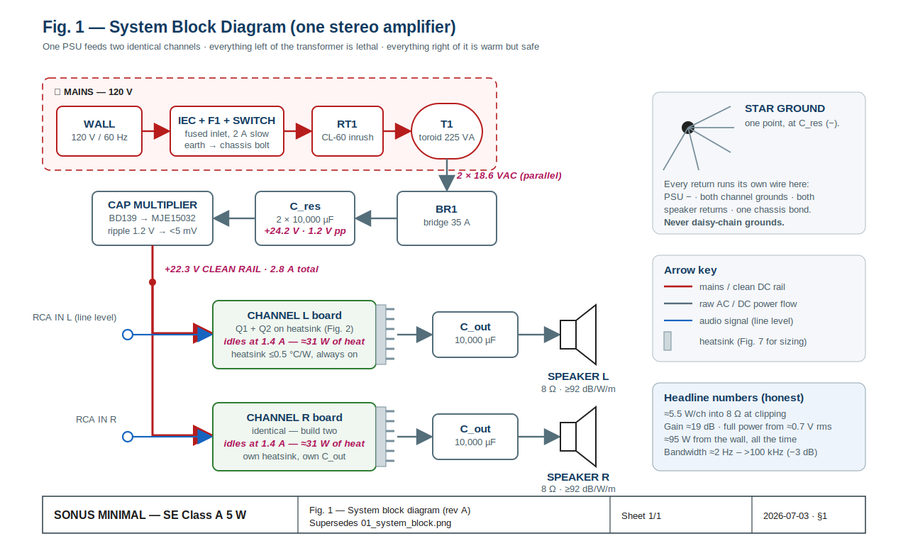

# Sonus Minimal

Single-ended Class A MOSFET stereo amplifier — ~5.5 W/ch into 8 Ω, Pass ACA lineage.
Three units to be built. This repo is the complete, resolved build package.

## Start here

1. **`LABBOOK.md`** — the build lab book. Everything is sequenced there: theory primer,
   the engineering change record (rev 3 → rev 4), the final design tables, and build
   phases A–G with gates and measurement logs.
2. Print `diagrams/fig02` (channel schematic), `fig03` (PSU schematic), and `fig05`
   (board map) for the bench.
3. Order from **`docs/BOM-rev4.csv`** (DigiKey-import compatible; read the import notes
   in LABBOOK §4.4).

## Layout

| Path | What |
|---|---|
| `LABBOOK.md` | The lab book — single source of build truth (§4 tables govern) |
| `docs/BOM-rev4.csv` | Authoritative parts list, rev 4 (supersedes rev 3) |
| `docs/original/` | Incoming handoff package: rev 3 BOM, design write-up, original PNG diagrams — **superseded**, kept for provenance |
| `diagrams/fig01…fig10*.svg` | Rev A figures: system, schematics, jig, boards, chassis, dim-bulb, milling plans |
| `spice/*.cir` | LTspice/ngspice decks for the channel and PSU (expected results in comments) |

## Design state (rev 4, 2026-07)

The eight open items in the handoff are resolved as ECR-1…8 in LABBOOK §3. The two
build-blocking fixes:

- **ECR-1:** capacitance multiplier is now a Darlington (BD139 → MJE15032) — the single-BJT
  version dropped ~12 V across the base feed at load.
- **ECR-2:** R_fb 47 k→82 k and Rb_bot 10 k→22 k (select-on-test) re-center the operating
  point for the IRFP150N; Zobel added. Verified numerically (see `spice/` and LABBOOK §3).

Honest headline numbers: +22.3 V rail, ≈5.5 W/ch at clip, ≈95 W from the wall continuously,
speakers ≥ 92 dB/W/m required.

## Rendering the figures

The SVGs are self-contained. To rasterize: `rsvg-convert -w 1600 diagrams/figNN-*.svg -o figNN.png`

## PDF book

**`SONUS-MINIMAL-LabBook-revA.pdf`** is the print/bench edition of `LABBOOK.md` (35 pages,
letter, cover + running headers + page numbers; figures embedded as vectors). To regenerate
after editing the markdown: pandoc → styled HTML → headless Chrome
(`--print-to-pdf --no-pdf-header-footer`); the print CSS starts each section on a fresh page
and keeps tables/figures unbroken.
