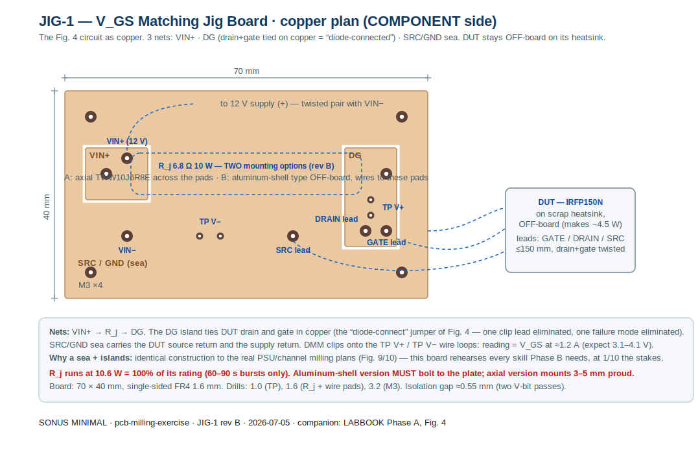
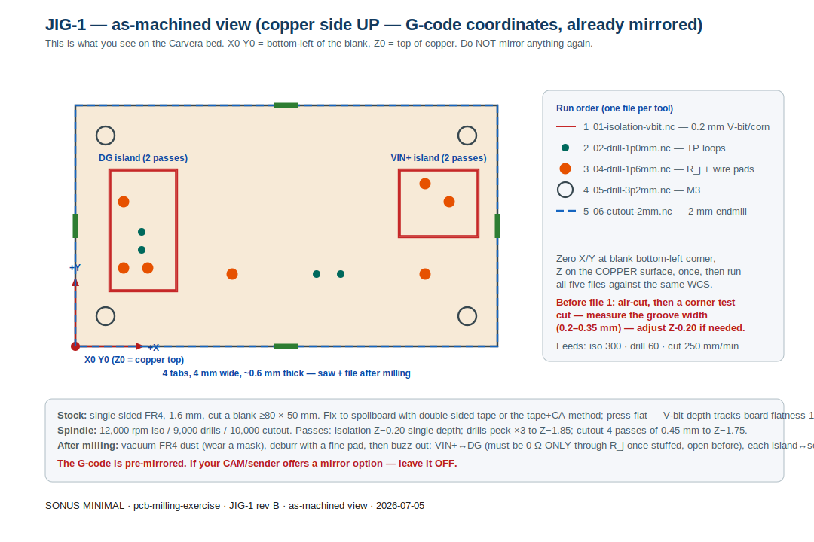

# PCB Milling Exercise — JIG-1 rev B (V_GS Matching Jig Board)

**The warm-up board for the Makera Carvera.** This is LABBOOK Fig. 4 — the MOSFET
matching jig — rebuilt as a single-sided milled PCB. It is deliberately the simplest
possible real board (3 nets, 11 holes, one resistor) while rehearsing *every* operation
the PSU board (Fig. 10) and channel boards (Fig. 9) will need:

| Skill practiced | Where it's used later |
|---|---|
| Isolation milling, ~0.5 mm gaps, sea + islands | Fig. 9/10 net islands |
| Two drill sizes + wire pads + TP loops | every board |
| Board cutout with tabs | every board |
| Mirroring convention (copper-up, pre-mirrored G-code) | every board |
| Buzz-out then live acceptance test | Phase B/C gates |

And it isn't a throwaway: the finished board runs **Phase A** — all 20 IRFP150N
measurements go through it.

## The circuit (see LABBOOK Fig. 4 for the schematic)

```
12 V supply (+) ──[VIN+ pad]──► R_j 6.8 Ω 10 W ──► DG island ──► DUT drain
                                                       │  (drain–gate tied in copper
                                                       │   = "diode-connected")
                                                       └──► DUT gate
DUT source ──► [SRC pad] ──► GND sea ──► [VIN− pad] ──► supply (−)
DMM: clips on TP V+ (DG) and TP V− (sea) → reading = V_GS at ≈1.2 A
```

Improvement over the clip-lead jig: the gate–drain jumper is **copper**, so one flying
lead and one intermittent-clip failure mode disappear. The DUT stays off-board on a
scrap heatsink — it dissipates ~4.5 W and R_j itself runs at ~10.6 W (at its rating:
readings are 60–90 s bursts, then power off).

## Board artwork





## Files

| File | Tool | What it does |
|---|---|---|
| `make_gcode.py` | — | regenerates all G-code (`python3 make_gcode.py`) |
| `gcode/01-isolation-vbit.nc` | 0.2 mm-tip V-bit or corn mill | 2 concentric outlines per island, Z −0.20 |
| `gcode/02-drill-1p0mm.nc` | 1.0 mm drill | 4 × TP loop holes |
| `gcode/04-drill-1p6mm.nc` | 1.6 mm drill | 7 × pads: R_j (either style) + VIN±, SRC, DRAIN, GATE |
| `gcode/05-drill-3p2mm.nc` | 3.2 mm drill | 4 × M3 mounting holes |
| `gcode/06-cutout-2mm.nc` | 2 mm endmill | outline, 4 passes, 4 tabs (4 mm × ~0.6 mm) |

G-code facts: metric, absolute (G21/G90), plain G0/G1 only (no canned cycles — safe for
the Carvera's Smoothieware-family controller), spindle M3/M5, ends M30.
**All coordinates are pre-mirrored for copper-side-up machining. Never mirror again.**
One WCS for all five files: X0 Y0 at the blank's bottom-left, Z0 on the copper.

## Bill of materials (everything is already in your orders)

| Item | Source status |
|---|---|
| R_j — 6.8 Ω 10 W, **either style** (rev B dual footprint): axial Ohmite TWW10J6R8E soldered across the pads, **or** the Amazon aluminum-housed type (50×50×20 mm listing, 19 mm solder lugs with 1.8 mm holes) mounted OFF-board | DigiKey delta (axial ×3) / Amazon (aluminum) |
| FR4 blank, single-sided, 1.6 mm — on hand: **150 × 100 mm** (any ≥80 × 50 works) | in stock |
| Bus wire (TP loops), hookup wire + alligator clips (DUT + supply leads) | delta-4 / bench |
| 12 V ≥1.5 A supply, DMM | bench |

⚠ **R_j thermal rule (both styles):** the jig runs it at 10.6 W = 100 % of rating —
fine for 60–90 s reads, but the aluminum-housed style **must be bolted to the plate**
(its rating assumes a heatsink) and the axial style mounts 3–5 mm proud in free air.
Aluminum style: bolt it next to the DUT heatsink, run two wires from its lugs (1.8 mm
holes — solder the wire through the hole) to the board's R_j pads. Axial style: solder
straight across the 54 mm pads.

## CarveraController run sequence (PCB Fabrication Pack)

The `.nc` files load **directly into CarveraController** — no FlatCAM/MakeraCAM needed.

0. **Load the ATC** (all ⅛″-shank tooling):

   | Slot | Tool | File |
   |---|---|---|
   | T1 | 0.2 mm-tip V-bit (30°/20°) or 0.2 mm corn mill — both in-pack sizes | 01 isolation |
   | T2 | 1.0 mm PCB drill | 02 |
   | T3 | 1.6 mm PCB drill | 04 |
   | T4 | 3.175 mm (⅛″) drill | 05 (M3 holes) |
   | T5 | 2.0 mm endmill | 06 cutout |
   | T6 | — empty — | |

   Each file fetches its own tool (`T# M6` in the header) — load the slots right and the
   machine handles changes + tool-length measurement itself.
   **Bit decision for T1**: 0.2 mm-tip V-bit → files correct as-is (groove ≈0.31 mm at
   Z −0.20; the two passes merge to the designed ≈0.55 mm gap). 0.2 mm corn mill → also
   works as-is, or set `ISO_Z = -0.12` and regenerate to spare the bit. (0.1 mm-tip bits
   exist as generic stock but aren't in the pack — and they snap; don't bother.)
   Mirror options stay OFF everywhere — files are pre-mirrored.
1. **Stock**: Makera 200 × 240 MDF spoilboard on the bed as-is (no cutting — fix it at
   the edges only), then the FR4 blank copper-UP on top (150 × 100 stock is fine — the
   origin defines the board, not the blank), full double-sided tape, pressed flat.
2. **Origin, once**: jog the laser crosshair to a point **~5 mm in from a corner** of
   the blank → Set Work Origin (Current Pos). The 70 × 40 board mills in that corner;
   the rest of the blank stays usable (a 150 × 100 also hosts one rotated 100 × 70
   channel board beside JIG-1). Never re-set the origin between files.
3. **File 01** (isolation): insert bit (auto tool-length runs) → upload → job start with
   **Auto-Level ON, ~15 points** over the 70 × 40 area → run. Copper left in a groove?
   Re-run with −0.05 controller Z-offset.
4. **Files 02 → 04 → 05** (drills 1.0/1.6/3.2): per file, swap drill → upload →
   **Auto-Level: reuse heightmap, do NOT re-probe** → run.
5. **File 06** (cutout, 2 mm endmill): reuse heightmap → run → vacuum FR4 dust (mask!).
6. Cut tabs, file, then the Acceptance section below.

## Manual run sequence (any G-code sender)

1. **Stock down**: tape (or tape+CA) the blank to the spoilboard, copper **up**. Press
   flat — V-bit depth errors equal flatness errors.
2. **Zero**: X/Y at the blank's bottom-left corner; Z on the copper surface (probe or
   paper). Same WCS for every file.
3. **Test cut** (mandatory first time): run the first few lines of `01-isolation` over a
   sacrificial corner, measure the groove — target ≈0.2 mm wide, clean copper edges.
   Groove too wide → raise Z by 0.05; doesn't break through → lower by 0.05.
4. Run files **01 → 06** in order (five files). With the ATC loaded per the slot table,
   tool changes are automatic (speeds/feeds in each header: 12 k/9 k/10 k rpm; 300/60/250 mm/min).
5. **Free the board**: cut the 4 tabs with flush cutters, file smooth. Vacuum all FR4
   dust — wear a mask; fiberglass fines are nasty.

## Acceptance (do all three before calling it done)

1. **Buzz-out (unstuffed)**: VIN+↔DG open · VIN+↔sea open · DG↔sea open.
   Then **tin the bare copper** (flux + drag a solder blob with a broad tip, or liquid
   tin) — that's the oxidation protection. No solder mask: nothing here can bridge, and
   the UV-mask workflow adds three stages + laser-offset calibration for zero benefit
   on a board this coarse.
2. **Stuff & buzz again**: solder R_j (3–5 mm proud) + TP loops + supply/DUT leads.
   Now VIN+↔DG must read ≈6.8 Ω, everything↔sea still open.
3. **Live test = LABBOOK Phase A, step A-2/A-3**: clip a DUT on its heatsink, 12 V on,
   60 s settle, read V_GS on the TP loops — expect 3.1–4.1 V at ≈1.2 A. First device
   measured = board commissioned = milling workflow proven for Fig. 10.

*JIG-1 rev B · 2026-07-05 · part of the Sonus Minimal build package.*
